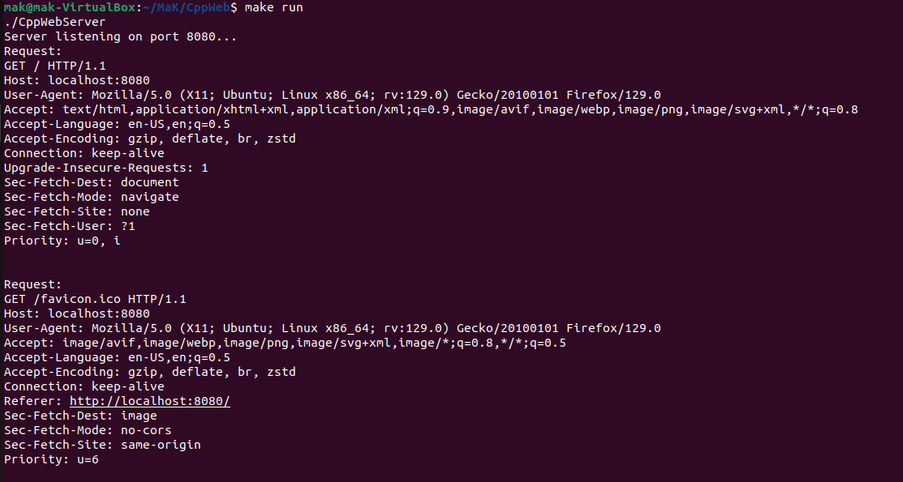

# CppWebServer

A lightweight, fast, and simple HTTP server written in C++. This project demonstrates how to handle HTTP requests and responses using basic networking features in C++.

## Current Achievements
 - Transmits hello world html page as a response to client.
 - Able to load the style.css and script.js

## TODO

- Handles basic HTTP GET and POST requests.
- Supports basic routing and URL handling.
- Lightweight and minimalistic design, focused on performance.
- Easily extensible to support additional HTTP methods and features.

## Requirements

- C++17 or later
- A C++ compiler (GCC, Clang, MSVC, etc.), Only tested in GCC.
- Basic networking libraries like `iostream`, `sys/socket.h`, `netinet/in.h`, etc.

## Installation

### Prerequisites

Make sure you have a C++17 compatible compiler installed (like GCC or Clang) and the required networking libraries are available.

### Steps to Build

1. Clone this repository:
   ```bash
   git clone https://github.com/The-Jat/CppWeb.git
   cd CppWebServer
2. Build the project (using g++):
   ```bash
   g++ -o server server.cpp
   ```
3. Run the server:
   ```c
   ./server
   ```
4. Your HTTP server will start and listen on port 8080 by default. You can access it via a web browser or tools like curl:
5. ```bash
   curl http://localhost:8080
   ```
   or Visit the brower at this link: http://localhost:8080

---
### Output

#### 1. Server Running  
The server is up and running successfully, as shown in the following screenshot:  



#### 2. Browser as Client  
The browser is used as a client to make a request to the server. The following screenshot demonstrates the response:  

